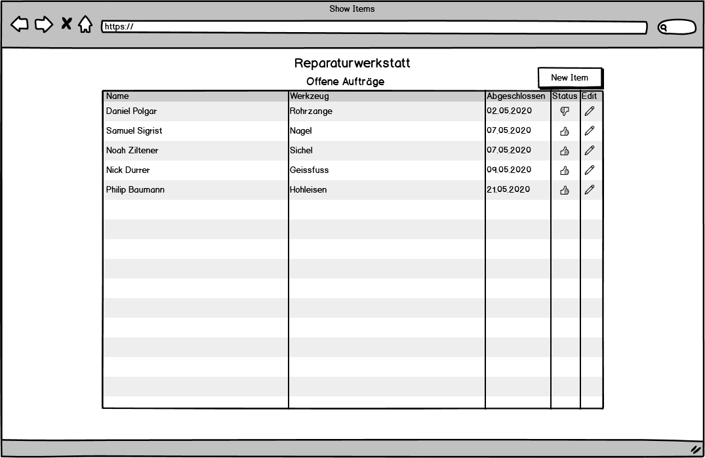
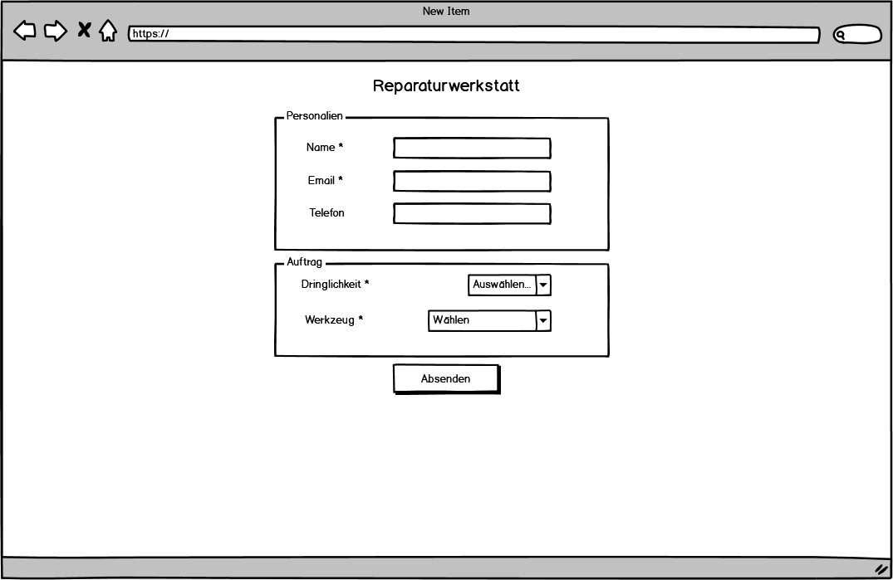
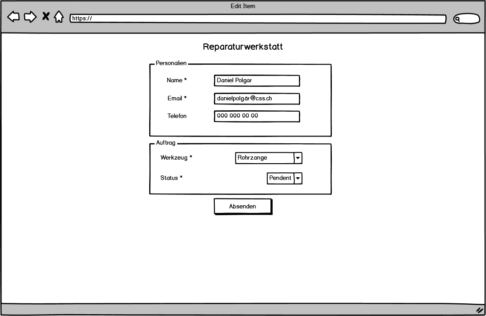

# M307-Reparaturwerkstatt

## Formulare
### List view
Diese View zeigt nur 

### Create view

### Edit item view

## Validierung
### List view
In dieser View befinden sich keine Felder zu validieren.

<a name="validation-newItem"/>
### New item view
* Name wird benötigt
* Email enthält das @-Zeichen
* Telefon enthält nur Nummern, Leerzeichen und das Symbol +, darf leer sein
* Dringlichkeit wird benötigt
* Werkzeug wird benötigt

<a name="validation-editItem"/>
### Edit item view
* Name wird benötigt
* Email enthält das @-Zeichen
* Telefon enthält nur Nummern, Leerzeichen und das Symbol +, darf leer sein
* Werkzeug wird benötigt
* Status wird benötigt

## Datenbank
### Table tools
* toolId int primary key not null
* name varchar(255) not null

### Table assignment
* assignmentId int primary key auto_increment
* name varchar(50) not null
* email varchar(100) not null
* phone varchar(15)
* progress tinyint(1) not null
* fkUrgencyId int not null
* fkToolId int not null
* createdAt date not null

### Table urgency
* urgencyId int primary key 
* name varchar(50) not null
* timeNeeded int not null

## Testfälle
### New orders show up in list view
* GIVEN in create view
* WHEN a user creates a new order
* THEN the new order appears in the list view

### List view doesn't show completed orders
* GIVEN order in edit view
* WHEN a user sets the order status to complete
* THEN the new order doesn't appear in the list view anymore

### Check inputs while creating
* GIVEN in create view
* WHEN a user tries to input invalid data ([criteria](#validation-newItem))
* THEN the form won't be submitted and a error message will show

### Check inputs while editing
* GIVEN in edit view
* WHEN a user tries to input invalid data ([criteria](#validation-editItem))
* THEN the form won't be submitted and a error message will show

### Set new orders in progress
* GIVEN in create view
* WHEN a user creates a new order
* THEN the new order is set 'in progress'

### Edit order name
* GIVEN One order in edit view
* WHEN a user edits the name
* THEN the name is updated and displayed in the list view.

### Oldest orders show on top
* GIVEN Multiple orders present, with different dates.
* WHEN a user opens the list view
* THEN the oldest order is shown on top, while the newest is shown at the bottom.

### Order and items in list view
* GIVEN in list view
* WHEN a user opens the list view
* THEN the following colums are visible: Name, Werkzeug, Abgeschlossen bis, Status

### Don't allow SQL injection
* GIVEN in create view
* WHEN a user creates a new order
* THEN SQL Injection is not working

### The page is showing
* GIVEN The browser is opened
* WHEN a user inserts the adress
* THEN the list view displays.

## Roadmap
|            | 05.05.        | 06.05.        | 07.05.|
| ---------- | :-------------: |:-------------:| :-----:|
| Vormittag  | -             | Modelierung | Views / Cleanup |
| Nachmittag | Konzeptionierung | Controllers |   Präsentation |
